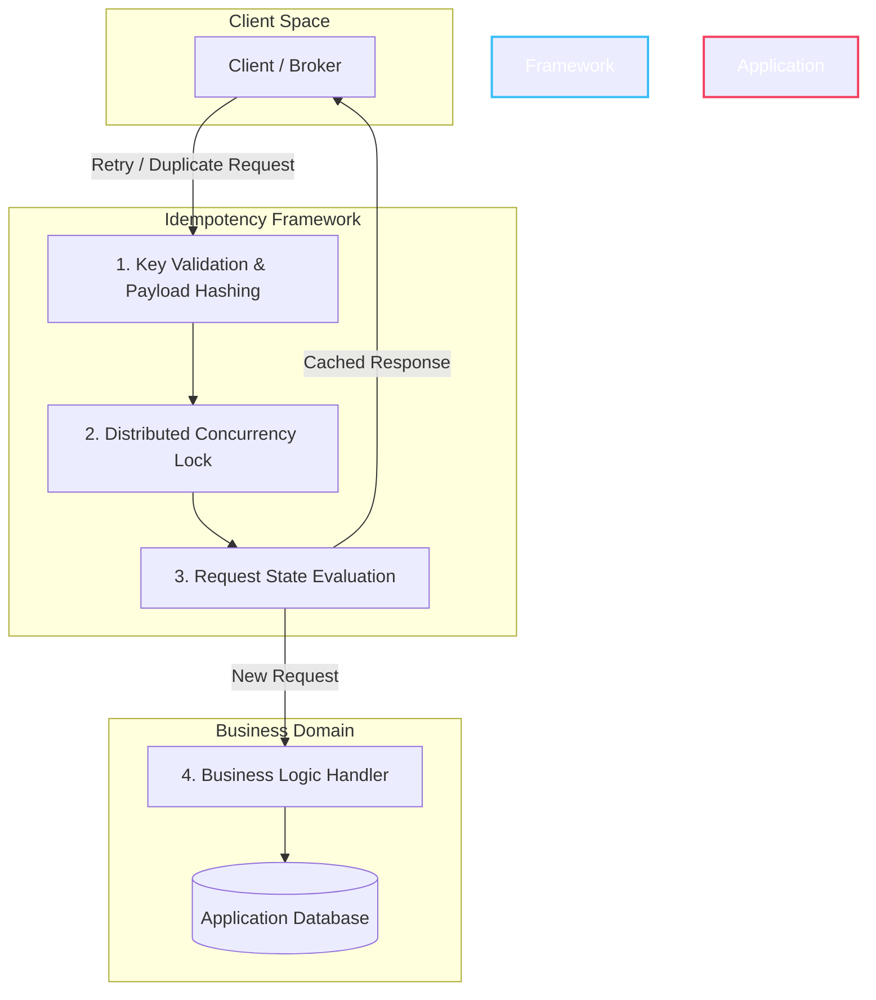
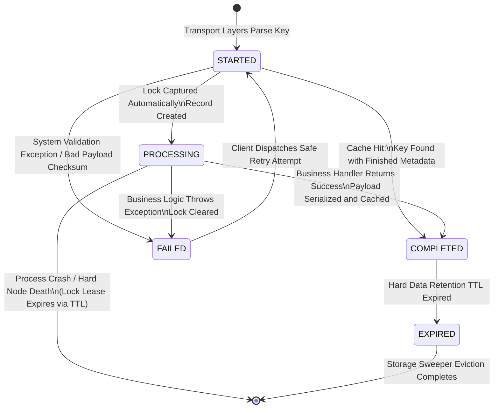

```mermaid
graph TD
    subgraph Client Space
        C[Client / Broker]
    end
    subgraph Framework Boundary [Idempotency Framework]
        Key[1. Key Validation & Payload Hashing]
        Lock[2. Distributed Concurrency Lock]
        Eval[3. Request State Evaluation]
        Key --> Lock
        Lock --> Eval
    end
    subgraph Application Boundary [Business Domain]
        Handler[4. Business Logic Handler]
        DB[(Application Database)]
        Handler --> DB
    end
    C -- Retry / Duplicate Request --> Key
    Eval -- New Request --> Handler
    Eval -- Cached Response --> C
    style Framework Boundary fill:#1e293b,stroke:#38bdf8,stroke-width:2px,color:#fff
    style Application Boundary fill:#0f172a,stroke:#f43f5e,stroke-width:2px,color:#fff
```

```mermaid
stateDiagram-v2
    [*] --> STARTED : Transport Layers Parse Key
    STARTED --> PROCESSING : Lock Captured Automatically\nRecord Created
    STARTED --> COMPLETED : Cache Hit:\nKey Found with Finished Metadata
    STARTED --> FAILED : System Validation Exception / Bad Payload Checksum
    PROCESSING --> COMPLETED : Business Handler Returns Success\nPayload Serialized and Cached
    PROCESSING --> FAILED : Business Logic Throws Exception\nLock Cleared
    PROCESSING --> [*] : Process Crash / Hard Node Death\n(Lock Lease Expires via TTL)
    COMPLETED --> EXPIRED : Hard Data Retention TTL Expired
    FAILED --> STARTED : Client Dispatches Safe Retry Attempt
    EXPIRED --> [*] : Storage Sweeper Eviction Completes
```