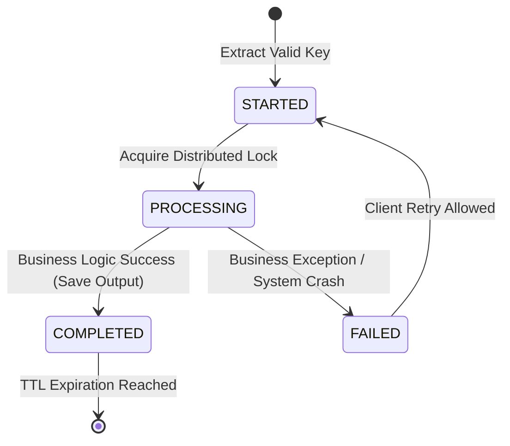

```mermaid
stateDiagram-v2
    [*] --> STARTED : Extract Valid Key
    STARTED --> PROCESSING : Acquire Distributed Lock
    PROCESSING --> COMPLETED : Business Logic Success (Save Output)
    PROCESSING --> FAILED : Business Exception / System Crash
    COMPLETED --> [*] : TTL Expiration Reached
    FAILED --> STARTED : Client Retry Allowed
```