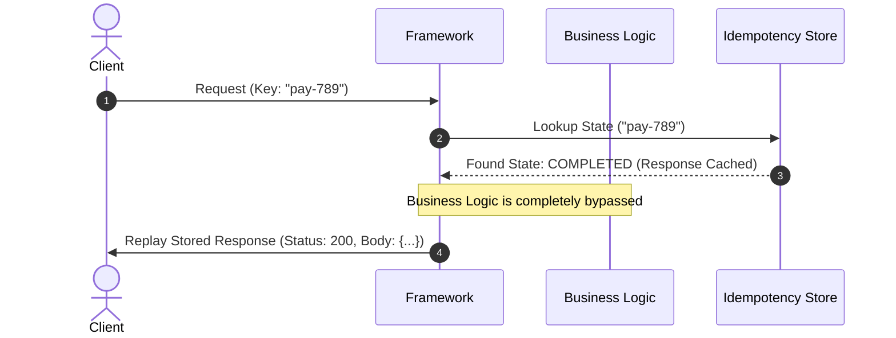
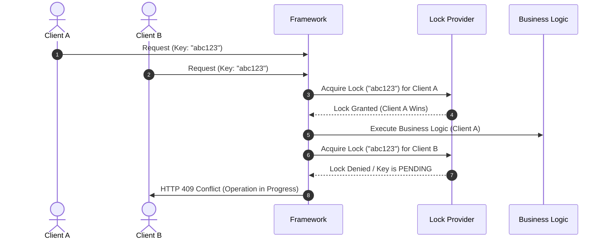
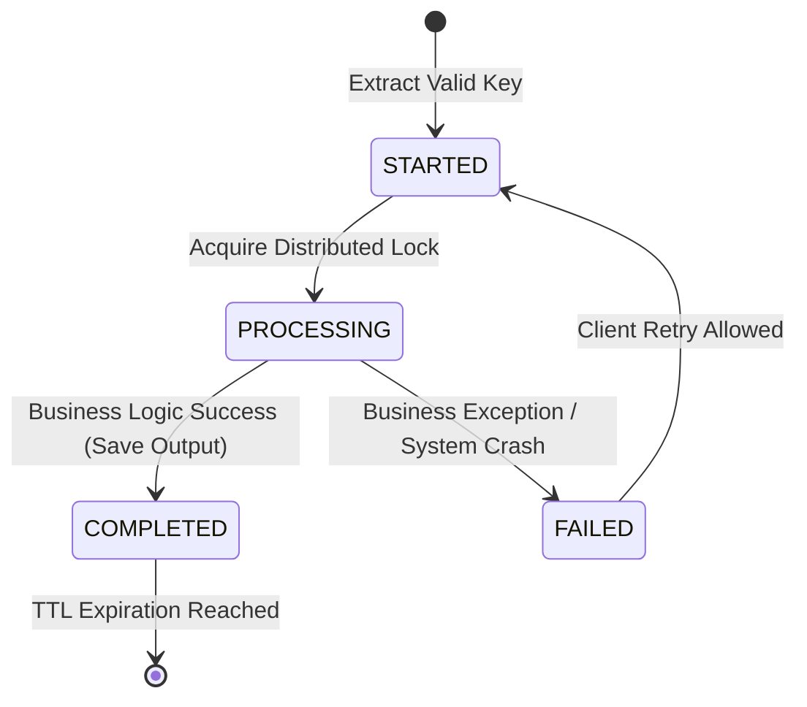

## 1. Introduction
This document defines 
- the functional and
- non-functional requirements
for the **Distributed Idempotency Framework.**

The framework guarantees 
- at-most-once execution of 
	- business operations across
		- distributed, 
		- stateless service nodes 
	- by 
		- validating, 
		- locking, and 
		- caching
			- idempotent transaction states.

---

## 2. Functional Requirements (FR)

### FR-001: Idempotency Key Extraction & Identification

* **Description:** 
  - The framework must 
	  - dynamically accept and
	  - extract a unique idempotency key 
		  - from incoming contexts (HTTP requests or message broker events).

* **Specifications:**
  * For HTTP transports, it must 
	  * default to parsing 
		  * the standard `Idempotency-Key` header (Case-Insensitive). 
	  * Example: `Idempotency-Key: abc123`.

  * The framework must support 
	  * a configurable custom extraction strategy to 
		  * allow keys to 
			  * be parsed from alternate sources (e.g., 
				  * query parameters, 
				  * nested JWT claims, or 
				  * specific JSON body properties).

  * If an operation requires 
	  * idempotency 
  * but the key is missing or 
  * syntactically invalid, 
	  * the framework must throw 
		  * a well-defined validation error before 
		  * invoking any core business logic.

### FR-002: At-Most-Once Execution Guarantee

* **Description:** 
	* The framework shall ensure that 
		* a core business operation tied to 
			* a unique idempotency key is 
				* executed exactly zero or one time.
* **Specifications:**
  * Subsequent execution attempts using 
	  * an identical key must bypass 
		  * the core handler function and 
		  * route directly to
			  * the response replay mechanism.
  * **Payload Validation (Mismatched Request Safeguard):** 
	  * To prevent malicious or 
	  * accidental key reuse across different operations, 
		  * the framework must optionally generate and 
		  * verify 
			  * a cryptographic checksum (e.g., SHA-256) of 
				  * the request payload signature.
	  * If the key matches but
		  * the signature does not, 
			  * the framework must reject
				  * the request with 
					  * a configuration-defined payload mismatch error (e.g., HTTP `400 Bad Request`).

### FR-003: Deterministic Response Replay
* **Description:** The framework shall cache and replay the exact output structure of a successfully completed request when a duplicate key is presented.
* **Specifications:**
  * When a retry occurs on an already completed key, the cached artifact must be deserialized and returned identically, tricking the client into a transparent success state while preserving system resources.

### FR-004: Concurrent Request Processing & Race Mitigation

- **Description:** 
	- The framework shall actively prevent 
		- race conditions when 
			- two or 
			- more distributed nodes 
				- receive an identical idempotency key at 
					- the exact same millisecond.
    
- **Specifications:**
    - The framework must utilize 
	    - an **atomic** distributed locking mechanism tied to 
		    - the key.
        
    - **First Request (Winner):** 
	    - Acquires the lock, 
	    - transitions state to 
		    - a transient running status, and
		    - proceeds to 
			    - business execution.
        
    - **Concurrent Request (Loser):** 
	    - Must detect the active lock/state. 
	    - The framework must support 
		    - two configurable fallback policies for the losing request:
        
	        1. **Block & Poll:** 
		        - Wait for a configured time-to-live window, 
				    - polling the database for the `COMPLETED` result.

	        2. **Fast-Failure:** 
		        1. Immediately 
			        - abort and 
			        - reject 
				        - the overlapping request with 
					        - an execution conflict error (e.g., HTTP `409 Conflict`).

### FR-005: Execution Lifecycle State Machine

- **Description:** 
	- The framework must explicitly 
		- manage and 
		- transition execution records through 
			- a rigorous state lifecycle.
    
- **Specifications:**
    
    - Supported states are strictly restricted to:
        - `STARTED`: 
	        - The key has been initialized; the system is verifying preconditions.
        - `PROCESSING`: 
	        - The distributed lock is securely held, and business logic is running.
        - `COMPLETED`: 
	        - Business logic finished without errors; the response payload is finalized.
        - `FAILED`: 
	        - Business logic threw a retryable application exception.
        - `EXPIRED`: 
	        - Clean-up status handled via automated TTL routines.

### FR-006: Comprehensive Serialization & Metadata Replay
- **Description:** 
	- The response storage blueprint must securely 
		- capture all essential protocol boundaries required for
			- complete downstream emulation.    
- **Specifications:**
    - The storage record must encapsulate three main components:
        1. **Status Code:** 
	        1. The exact native protocol boundary 
	        2. (e.g., HTTP `201 Created`, RPC code).
        2. **Headers / Metadata:** 
	        1. Contextual headers 
	        2. (e.g., `
		        1. Content-Type, 
		        2. custom downstream correlation IDs), 
		        3. excluding 
			        1. non-idempotent hop-by-hop tracking properties.
        3. **Body:** 
	        - Raw string, 
	        - Buffer, or 
	        - compressed stream payload
		        - serialized transparently.

### FR-007: Time-To-Live (TTL) & Configurable Expiration
- **Description:** 
	- To prevent database bloat, 
		- every idempotency record must map to 
			- an expiration window.
- **Specifications:**
    - The TTL duration must be 
	    - fully configurable globally or 
	    - overridable dynamically at 
		    - the endpoint level (e.g., 
			    - standard defaults of
			    - `24 hours`, `7 days`, or `30 days`).
        
    - The framework must rely on 
	    - the storage tier’s native TTL mechanisms 
		    - (e.g.,
			    - Redis `EXPIRE`, 
			    - DynamoDB `TTL attribute`) 
		- to minimize continuous background sweeping overhead.

### FR-008: Protocol & Event Agnosticism
- **Description:** 
	- The internal processing layer must
		- decouple entirely from web specifications, 
			- allowing it to govern 
				- message queues and 
				- asynchronous event streaming platforms natively.
- **Specifications:**
    - It must parse
	    - alternative deterministic keys such as 
		    - RabbitMQ/SQS `messageId`, 
		    - Kafka event properties, or 
		    - CloudEvents `eventId` / `correlationId`.
    - Internal interface definitions must map 
	    - generic context abstractions (`RequestContext<T>`)
	    - rather than binding tightly to
		    - Express/NestJS request envelopes.

## 3. Nonfunctional Requirements (NFR)

### NFR-001: Availability & Failure Isolation (No SPOF)
- **Description:** 
	- The framework must 
		- fail-safe and 
		- must never cause 
			- total application downtime 
				- if the underlying idempotency database layer
					- degrades.
- **Specifications:**
    - The framework must implement 
	    - a configurable **Bypass on Storage Failure** (Fail-Open) flag. 
	- If the 
		- Redis cluster or
		- Postgres instance
			- throws a socket timeout, 
				- the framework can 
					- catch 
						- the error, 
					- fire 
						- an alert metric, 
					- and allow
						- the request to 
							- execute the business logic
								- un-idempotently rather than
								- throwing hard crash codes to clients.

### NFR-002: Ultra-Low Latency Performance Target
- **Description:** 
	- The operational complexity added by 
		- key discovery, 
		- checking, and 
		- state lookup must
			- not noticeably slow down 
				- request-response round-trips.
- **Specifications:**
    - Total internal lookup and
    - lock verification latency overhead must resolve at
	    - **P95 < 10ms** and **P99 < 15ms**, 
	    - assuming standard low-latency infrastructure topologies 
		    - (e.g., 
			    - Redis deployed within the same private VPC cloud region as
				    - the app servers). 
	- This baseline explicitly excludes time spent inside 
		- user business code.

### NFR-003: Stateless Horizontal Scalability
- **Description:** 
	- The framework must function accurately across 
		- distributed compute nodes without 
			- sharing localized state memory.
- **Specifications:**
    - If `Node A` locks a key,
	    - `Node B` and 
	    - `Node C` running in different geographical containers or
		    - load-balanced availability zones must immediately 
			    - register that lock state via a 
				    - centralized, 
				    - distributed storage mechanism.
	- Localized in-memory fallback stores are only permitted during single-instance integration testing.

### NFR-004: Execution Consistency
- **Description:** 
	- The system must guarantee 
		- at-most-once execution for 
			- any uniquely valid key.
- **Specifications:**
    - The framework must never allow 
	    - data states to
		    - split, 
		- resolving all synchronization issues via 
			- strict concurrency bounds. 
	- Under extreme database partitions
		- where consistency cannot be verified,
			- it must default to 
				- safety (aborting the incoming request) unless
				- configured to fail-open under NFR-001.

### NFR-005: Modular Architecture & Extensibility
- **Description:** 
	- The data-access and 
		- locking layer must follow 
			- solid Dependency Inversion patterns.
- **Specifications:**
    - Engineers must be capable of switching from
	    - `RedisStore` to
	    - `PostgresStore`, 
	    - `DynamoStore`, or 
	    - any custom internal storage option by
		    - simply passing 
			    - a pluggable class instance implementing 
				    - a strict `IIdempotencyStore` core engine interface.
	- No core logic modifications are permitted during engine changes.
        

### NFR-006: Clean Domain Testability

- **Description:** 
	- The core engine domain must stay clear of 
		- external platform side-effects.
- **Specifications:**
    - The business state machines, 
    - hashing algorithms, and 
    - validation structures must be 
	    - executable and 
	    - fully unit-testable using
		    - mock/in-memory adapters, 
			    - without demanding spinning up active external network connections, Docker instances, or active Express engines.
        

### NFR-007: Deep Enterprise Observability
- **Description:** 
	- The framework must supply 
		- continuous debugging and 
		- operation visibility signals.
    
- **Specifications:**
    - **Metrics:** 
	    - Expose Prometheus/OpenTelemetry standard counters for 
		    - `idempotency_cache_hits`, 
		    - `idempotency_cache_misses`, 
		    - `idempotency_lock_conflicts`, and 
		    - histogram durations for 
			    - store read/write performance.
    - **Traces:** 
	    - Auto-inject span tags into 
			- parent contexts 
				- indicating whether a request was 
					- replayed or 
					- freshly evaluated
					- (`idempotency.action = "replay"` vs `"executed"`).
    - **Logs:** 
	    - Output 
		    - structured, 
		    - JSON-formatted telemetry messages 
			    - detailing 
				    - status mutations along with
				    - context fields.

## 4. Expected Core Storage Schema Data Model

Any data engine adapting to the framework must accurately write and read a structured object model mapping closely to the following definition:

|**Field Name**|**Data Type**|**Description**|
|---|---|---|
|`key_hash`|`VARCHAR(64)` / `STRING`|Primary Identifiers: SHA-256 hash string combining key + request path.|
|`client_key`|`TEXT` / `STRING`|The raw, unhashed key extracted from the transport layer.|
|`status`|`ENUM`|Current phase: `STARTED`, `PROCESSING`, `COMPLETED`, `FAILED`.|
|`payload_hash`|`VARCHAR(64)`|The optional request payload checksum to ensure payload integrity matches.|
|`response_code`|`INTEGER`|Stored HTTP status or transport status code (e.g., `200`, `201`).|
|`response_headers`|`JSON` / `TEXT`|Serialized map of transport key-value headers to return.|
|`response_body`|`TEXT` / `BLOB`|The actual serialized output payload data returned by the underlying handler.|
|`locked_at`|`TIMESTAMP`|Millisecond boundary when the lock was captured.|
|`expires_at`|`TIMESTAMP`|Hard deadline boundary indicating when the record is subject to purge sweep.|
