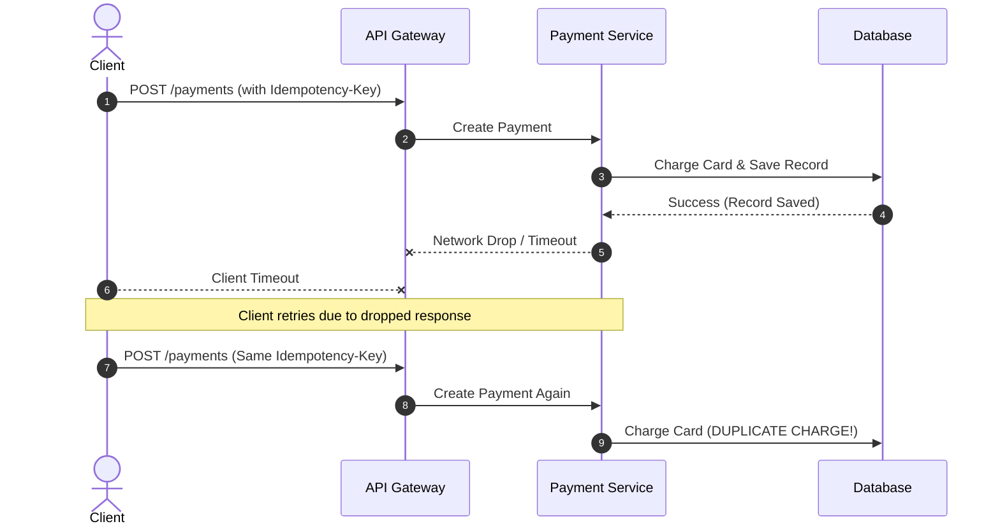
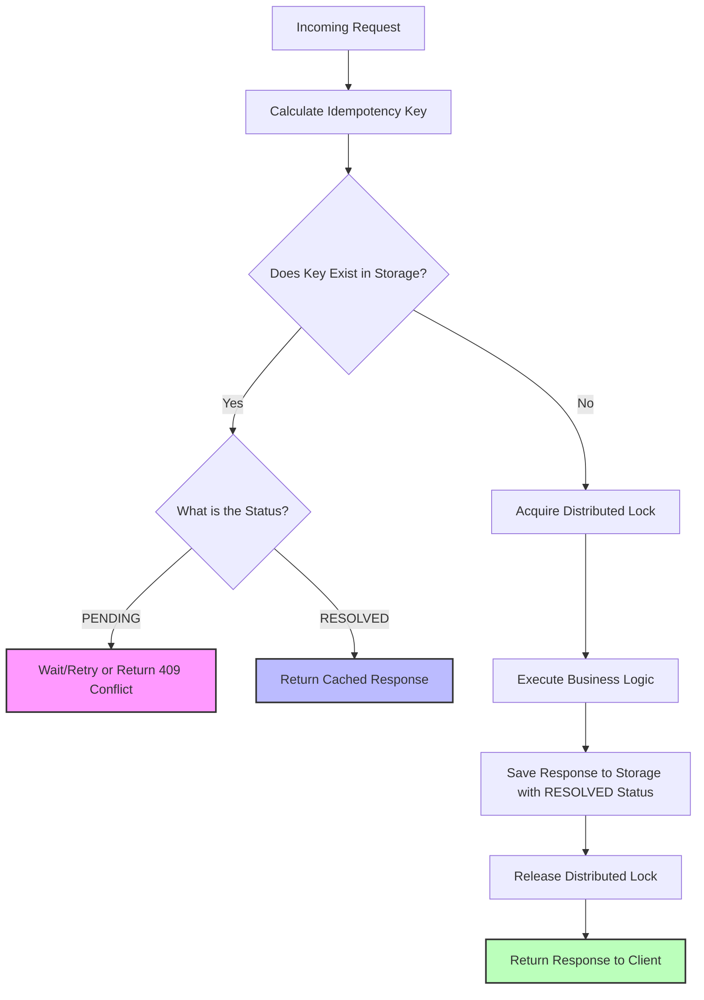

## Purpose
The Idempotency Framework provides
- robust,
- reusable, and
- framework-agnostic infrastructure
- for safely handling
- duplicate requests and
- events in
- distributed systems.

It guarantees that

- a logically identical operation is
- executed exactly once,
- allowing clients to
- retry failed or timed-out requests without risking
- data corruption,
- duplicate charges, or
- inconsistent state.

  

---

## Problems We Solve

### The Distributed Systems Reality

In a distributed environment, 
- network partitions, 
- transient failures, and 
- timeouts are inevitable. 

Systems must be designed under the assumption that
- **networks are unreliable**.

  
Modern architectures experience frequent retries due to:
* **Network failures:** 
	* Dropped packets during request or response transmission.
* **Client retries:** 
	* Mobile apps or frontends resubmitting forms when a spinner takes too long.
* **Gateway/Proxy retries:** 
	* API Gateways automatically retrying upstream `5xx` errors.
* **Queue redelivery:** 
	* At-least-once delivery guarantees in
		* message brokers (Kafka, RabbitMQ, SQS).
* **Service crashes:**
	* A process dying *after* completing an action but 
		* *before* responding to the client.

### The Cost of Failure

Without structured idempotency management, naive retry logic leads to severe business and data integrity issues:

  

**Business Impact:**

* **Financial Loss:** 
	* Double-charging customers or double-allocating refunds.
* **Inventory Inconsistency:** 
	* Over-allocating seats, tickets, or warehouse stock.
* **Data Corruption:** 
	* Creating duplicate resource state that requires manual, complex database reconciliation.

---

## Intended Users

This framework is built for 
- **Backend**, 
- **Platform**, 
- **and Distributed Systems**

Engineers building high-stakes applications, specifically:
* **Transactional Systems:**
	* Payment gateways, 
	* billing engines, and 
	* ledger systems.
* **E-Commerce & Logistics:** 
	* Checkout pipelines, 
	* inventory allocation, and 
	* booking engines.
* **Asynchronous Processors:** 
	* Webhook consumers, 
	* event-driven microservices, and 
	* workflow engines (e.g., Temporal workers).

---
## Supported Platforms & Ecosystems
To maximize adoption, the framework uses a decoupled core-and-adapter architecture.

* **Initial Launch (Tier 1):** * Node.js (TypeScript Core)
	* Express (Middleware)
	* NestJS (Guards/Interceptors
* **Future Roadmap (Tier 2):** * Fastify & Hono
	* Serverless environments (AWS Lambda, Cloudflare Workers)
	* Polyglot ports (Go, Java) based on architectural patterns established here.

---

## Design Goals & Core Principles

### 1. Hard Reliability & Race Condition Prevention
* **Strict Mutual Exclusion:** 
	* Use distributed locking to 
		* ensure that if two identical requests arrive simultaneously, 
			* one processes while 
			* the other waits or is safely rejected.
* **Atomic Transitions:** 
	* State changes of a request (e.g., `PENDING` $\rightarrow$ `RESOLVED`)
		* must be atomic.

### 2. Radical Framework Agnosticism
* The core idempotency engine must be 
	* pure TypeScript/JavaScript.
* It must have zero dependencies on web frameworks (Express/NestJS) or 
	* specific storage engines (Redis/DynamoDB). 
	* All integration points must be interface-driven.
### 3. Extensibility via Dependency Injection
Developers should be able to swap out key components easily:

* **Storage Engines:** 
	* In-memory (for testing), 
	* Redis, 
	* PostgreSQL, 
	* DynamoDB, 
	* MongoDB.
* **Lock Providers:** 
	* Redlock, 
	* Postgres advisory locks, 
	* AWS DynamoDB conditional writes.
* **Serialization Strategies:** 
	* JSON, 
	* Protocol Buffers, 
	* MessagePack (for high-throughput, low-latency needs).
* **Key Derivation:** 
	* Customizable hashing strategies based on 
		* request headers, 
		* JWT claims, or 
		* request bodies.
### 4. Enterprise-Grade Observability
Idempotency behavior must not be a black box. 
- The framework natively exposes:
* **Metrics:** 
	* Cache hit/miss ratios, 
	* conflict/lock-contention rates, 
	* execution latency overhead.
* **Traces:** 
	* OpenTelemetry integration 
		* to track request propagation and 
		* lock acquisition times.
* **Logs:** 
	* Structured, 
	* contextual logging detailing exactly why 
		* a request was flagged as a duplicate.

---
## Conceptual Architecture & Lifecycle

When a request enters the framework, it undergoes a strict lifecycle to evaluate whether it should execute or return a cached result:

## Success Metrics (KPIs)
We will measure the success of this framework based on:
* **Correctness:** 
	* Zero dual-execution bugs in production environments utilizing the framework.
* **Performance Overhead:** 
	* Less than **$5\text{ms}$** added latency to the primary request path for key verification and storage under normal network conditions.
* **Developer Velocity:**
	* Reducing the time it takes a product team to implement safe retry logic on a new endpoint from days to minutes.
